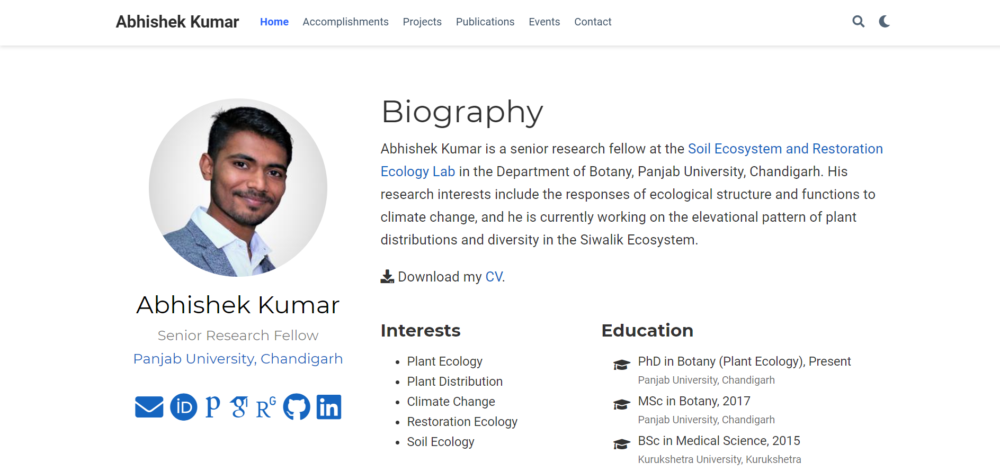

# Academic Website for [Abhishek Kumar](https://akumar.netlify.app/)

This website was developed using the Hugo [**Academic Resumé Template**](https://github.com/wowchemy/starter-academic).

[**Wowchemy**](https://wowchemy.com) makes it easy to create a beautiful website for free. Edit your site in Markdown, Jupyter, or RStudio (via Blogdown), generate it with Hugo, and deploy with GitHub or Netlify. Customize anything on your site with widgets, themes, and language packs.

